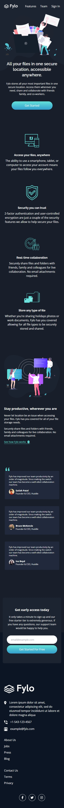

# Fylo Landing Page

Landing Page, inspirado en un Challenge de Frontend Mentor.
Cuyo diseño se adapta en pantallas mobile(375px), tablet(768px) y desktop(1440px).

   


## Construido con 🛠️

- React
- TypeScript
- Tailwind CSS
- Vite


## Instalación ⚙️

### 1. Clonar repositorio
```
git clone https://github.com/nombre-usuario/nombre-repo.git
cd fylo-landing-page
```
### 2. Instalar dependencias
```
npm install 
```

### 3. Ejecutar proyecto
```
npm run dev
```


## Despliegue 🚀
Puedes ver la versión desplegada del proyecto aquí:
```
 colocar pagina desplegada
```

